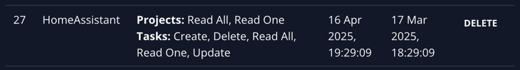

# Vikunja Home Assistant Integration

This Home Assistant integration allows you to sync tasks from your [Vikunja](https://vikunja.io/) instance to Home Assistant. You can view and manage tasks as entities and sensors within the Home Assistant UI.

[](https://my.home-assistant.io/redirect/config_flow_start/?domain=vikunja)

## Features

- Fetch tasks from Vikunja and display them as entities in Home Assistant
- Supports viewing and completing tasks. (more to come)
- Easy integration with Home Assistant UI for task management

## Installation

### Option 1: Install via HACS (Home Assistant Community Store)

#### Add Repository

1. Open HACS. Click the ... in the top right and "Custom Repositories" 


2. Add the link to this repository and select "Integration" from the dropdown.


3. Then install Vikunja integration.


#### Install Integration

1. Open Home Assistant and go to **Settings** > **Integrations**.
2. Click the **+** icon in the bottom right corner to add an integration.
3. Search for **Vikunja** in the list and select it.
4. Follow the prompts to complete the installation.

### Option 2: Manual Installation

1. Download the integration repository from GitHub.
2. Place the `custom_components/vikunja` folder inside the `custom_components/` directory in your Home Assistant configuration folder.
   - The folder structure should look like this:
     ```
     homeassistant/
     └── custom_components/
         └── vikunja/
     ```
3. Restart Home Assistant.

## Configuration

Once the integration is installed, you need to provide your Vikunja instance's URL and API key.

### API Key

1. Go to your Vikunja instance at [https://vikunja.io/](https://vikunja.io/) or your self-hosted Vikunja.
2. Log in to your account.
3. Navigate to the **API Keys** section in your Vikunja user settings.
4. Create a new API key.
5. Copy the generated API key.

### Configuration.yaml

This integration can be setup from the UI, so simply go to "Devices" -> "Add integration" and search for Vikunja.

Or use this button:


[](https://my.home-assistant.io/redirect/config_flow_start/?domain=vikunja)

### Permissions

The API key needs permission to read and update tasks. This allows Home Assistant to fetch and update task data. Ensure that the key has sufficient privileges for accessing the task-related endpoints.

These are the permissions I have that work:



### Usage
After successfully setting up the integration, Vikunja tasks will automatically appear as sensors and entities in Home Assistant. You can view their status, modify task attributes, and automate based on task data.


### Contributing
**Note** I am considering committing this to become a core home assistant integration but using HACS as a quicker to market solution.

If you'd like to contribute to this project, feel free to submit a pull request.